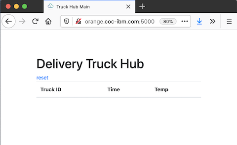

# Simple temperature monitoring service for IEAM demo

This project is a simple service that is managed and deployed by the 
IBM Edge Application Management.  This demo application simulates 
the collection and reporting of temperature values in a delivery 
truck. 

To perform this step in the demo you will need to have a Docker Hub account to publish the service to, and you will need to know the URL of the Truck hub application.  This information should be available on the details section of the specific environment on the [CMC portal edge environments](https://cmc.coc-ibm.com:5000/edge).

To publish and deploy a this new service you must pull this git repository onto one of the nodes being mamanged by the EDS tool.  Open up a SSH session (via web terminal or local terminal app) to one of the managed nodes (i.e. `dev1`).

### Start up the Truch Hub application

1. Open up a new browser window using the URL of the Truck Hub application (see description above).  Resize the window so it always appears in a corner of the screen (so we can notice when the services start getting deployed to nodes).\
\
If there already is data there, then press the reset button.  If data continues to appear then this means that this demo was not cleaned up the last time it was done.  See the Clean Up section below to properly reset this demo.



### Inside a HZN node

1. Clone this git repository and change to its directory with the commands;

```shell
git clone https://github.com/IBM-ICP-CoC/coc-truck.temp-mon.git
cd coc-truck.temp-mon/

```

2. You will need to set a couple of environment variables that service and business definitions need.  The `DOCKER_REPOSITOR_BASE` is your repository namespace on Docker hub (it is usually also your username).


```shell
export DOCKER_REPOSITORY_BASE=<YOUR DOCKER REPOSITORY BASE>
export TRUCK_HUB_URL=<TRUCK HUB URL>

```

3. Log into docker (hub) with yoru credentials.  This is required to push the signed container image to the hub.

```shell
docker login 

```

4. The application code and Dockerfile are in the current directory.  You can examine the `app.js` file to see how simple this service is.  Then you can build it locally, taqgging the image for the docker hub.

```shell
docker build -t $DOCKER_REPOSITORY_BASE/coc-truck.temp-mon_amd64:1.0.2 .

```

5. View the service definition file. You will see the use of the environment variables and the name and version of the service and the container image name.  Exit the editor with Ctrl-x.

```shell
nano svc_def.json

```

6. In order to sign the container image you need to create/get a key from the echange hub.  The following command will generate a key signed by the given email address (but using the current amdin `hzn` credentials).

```shell
hzn key create IBM jconallen@us.ibm.com

```

7. Now that a key has been obtained you can request the hub to sign it, push it to Docker Hub and publish it as a service in the excvhange.

```shell
hzn exchange service publish -f svc_def.json


```

8. You can verify the service was created with the UI, or with the following command.

```shell
hzn exchange service list

```

9. With the service available we can publish a business policy that describes what nodes should run this service.  View this policy definition with the following command, and then exit the editor with Ctrl-x.

```shell
nano bus_policy.json

```

10. Publish the policy with the following command.

```shell
hzn exchange business addpolicy --json-file=bus_policy.json coc-truck.temp-mon_1.0.2

```

11. Verify the new business policy with UI, or with the following command.

```shell
hzn exchange business listpolicy

```

12. You can now check the status of the nodes that are expected to be running this service (`dev6` - `dev10`).

13. You should also minitor the Truck Hub web application for new temperature reportings.

### Clean Up

When you are finished the demo you should clean up what you did on the node.

1. Remove the business policy first, then the service.

```shell

hzn exchange business removepolicy -f bb8/coc-truck.temp-mon_1.0.2

hzn exchange service remove -f bb8/coc-truck.temp-mon_1.0.2_amd64

```

2. Next, remove the git project from the node.

```shell

cd ~

rm -rf coc-truck.temp-mon

```

3. Next, remove the local docker image, and log out of docker.

```shell

docker rmi $DOCKER_REPOSITORY_BASE/coc-truck.temp-mon_amd64:1.0.2

docker logout

```

4. Remove your docker base environment variable (you can leave the truck hub one, since the next person will also be using it).

```shell

unset DOCKER_REPOSITORY_BASE

```

5. Finally remove they signing keys you created with the hub.

```shell
rm -rf ~/.hzn/keys

```

